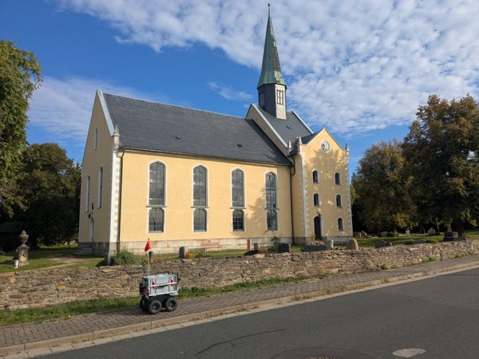

# Rosees Roboterreise

**Am 7. Oktober 2026 ist Rosee, der Roboter aus dem RoboLab der TU Bergakademie Freiberg, von Freiberg bis ins 4transferLab nach Dresden gereist.**

👉 **Karte mit Route und Fotos: https://sebastianzug.github.io/RoseesRoboterReise/**

## Worum geht es?

Die Reise soll zeigen, dass Robotik auch – und gerade – im ländlichen Raum möglich ist.

Dort stellen sich andere Herausforderungen als in der Stadt: Feldwege statt Gehwege, Straßen ohne Bürgersteig, lange Strecken zwischen den Orten. Zugleich eröffnen sich auf dem Land andere Möglichkeiten, Robotik für die **Daseinsvorsorge** einzusetzen – also dafür, Menschen auch abseits der Städte mit dem zu versorgen, was sie für ihren Alltag brauchen.

Rosees Weg von Freiberg durch die Dörfer und Felder bis nach Dresden macht beides sichtbar: das Unterwegssein auf dem Land und die Ankunft in der Stadt.

Die Reise steht im Zusammenhang mit dem Forschungsprojekt **[Lieferroboter-3L](https://lausitzerlieferroboter.de/)** – „Lieferroboter für den ländlichen Raum in der Lausitz“. Es untersucht, wie wirtschaftlich, gesellschaftlich akzeptiert und technisch machbar Lieferroboter auf dem Land sind.

## Die Reise

| | |
|---|---|
| **Start** | RoboLab der TU Bergakademie Freiberg, Burgstraße 36, Freiberg – 7. Oktober 2026, ca. 7:15 Uhr |
| **Ziel** | 4transferLab, Fritz-Reuter-Straße 1, Dresden-Neustadt – angekommen gegen 18:50 Uhr |
| **Route** | 37,9 km über Feld- und Radwege, Ortsdurchfahrten und Landstraßen bis an den Dresdner Stadtrand |
| **Weiter mit** | Straßenbahn Linie 7 durch Dresden bis zur Haltestelle Bischofsweg, dann zu Fuß zum 4transferLab |

Rosee fuhr den Großteil der Strecke selbst, begleitet vom Team. Einen Abschnitt zwischen km 21 und km 29 legte Rosee wegen der hohen Verkehrsbelastung im Feierabendverkehr im Kofferraum zurück – auf der Karte ist er orange gestrichelt markiert. Am frühen Abend ging es in Gompitz in die Straßenbahn, vorbei an Semperoper und Theaterplatz, und vom Bischofsweg die letzten Meter zu Fuß ins 4transferLab.

Unterwegs hat das Team **59 Fotos** gemacht. Sie erscheinen auf der Karte genau dort, wo sie aufgenommen wurden – ein Klick auf einen Foto-Pin zeigt Bild, Uhrzeit und Streckenkilometer.

## Beteiligte

- **RoboLab der TU Bergakademie Freiberg** – Robotiklabor des Instituts für Informatik, Burgstraße 36, Freiberg
- **[Lieferroboter-3L](https://lausitzerlieferroboter.de/)** – Forschungsprojekt der BTU Cottbus-Senftenberg mit der TU Bergakademie Freiberg und Partnern aus der Lausitz, gefördert vom Bundesministerium für Digitales und Verkehr
- **4transfer** – Innovationsverbund für Wissens- und Technologietransfer, mit dem 4transferLab in der Dresdner Neustadt als Ziel der Reise

## Die Karte

Die Webseite zeigt

- die gefahrene Route von Freiberg nach Dresden,
- die Straßenbahn Linie 7 und den Fußweg zum 4transferLab,
- alle Fotos von unterwegs als Pins entlang der Strecke,
- einen einblendbaren Zeitplan (Startzeit und Tempo frei wählbar).

Wie die Karte aufgebaut ist, wie Fotos automatisch dazukommen und wie die Daten aktualisiert werden, steht in [TECHNIK.md](TECHNIK.md).
